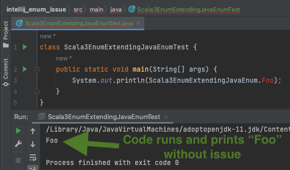
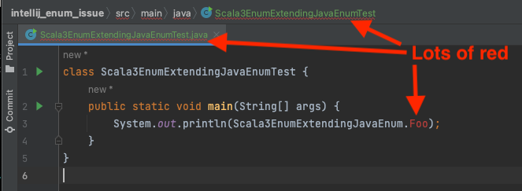
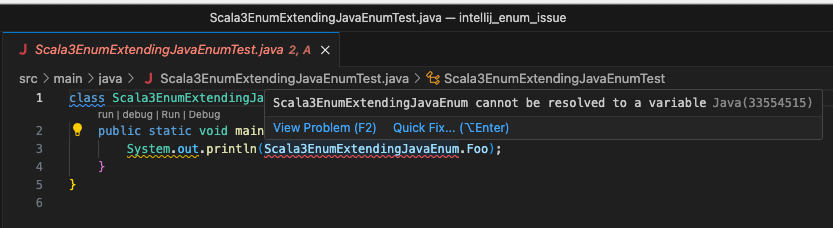

## Testing IDE support for Scala 3 Enums

This simple demo project shows that IDEs seem to have issues with Scala 3 Enums when they are used in Java (see [Scala 3 docs](https://docs.scala-lang.org/scala3/reference/enums/enums.html#compatibility-with-java-enums) on compatibility of Scala 3 enums with Java enums).

### Issue description

The code in `src/main/java/Scala3EnumExtendingJavaEnumTest.java` runs without issue (e.g. try `sbt run` or run it in IntellIJ).

However, IntelliJ IDEA's code completion appears to be "confused" by the usage of a Scala 3 enum in a Java context. Here's a screenshot from IntelliJ IDEA 2023.1.2 Ultimate Edition (Build #IU-231.9011.34, built on May 15, 2023) using the 2023.1.562 version of the Scala plugin:

The "Foo" in "Scala3EnumExtendingJavaEnum.Foo" is unrecognized by the IDE.

Visual Studio Code appears to have even more trouble than IntelliJ IDEA. Visual Studio Code does not recognize `Scala3EnumExtendingJavaEnum`. Instead it shows the error message "Scala3EnumExtendingJavaEnum cannot be resolved to a variable":

### Usage

This is a bare bones scala3 project generated via the `sbt new scala/scala3.g8` command

This is a normal sbt project. You can compile code with `sbt compile`, run it with `sbt run`, and `sbt console` will start a Scala 3 REPL.

For more information on the sbt-dotty plugin, see the
[scala3-example-project](https://github.com/scala/scala3-example-project/blob/main/README.md).
